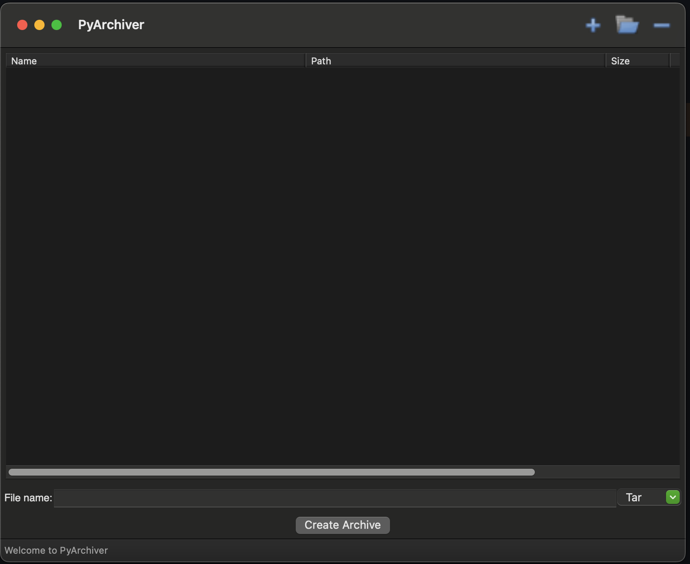

# PyArchiver

A drag and drop archiver desktop application written in Python and wxPython.

---

## Running it

- Clone it.
- Create a Virtual Environment of your choice and start it.
- `pip install -r requirements.txt`

---

## Todos

- [ ] Add support for `.zip`

---

## Resources

- [wxPython](https://wxpython.org/)
- [ObjectListView](https://objectlistview-python-edition.readthedocs.io/en/latest/)
